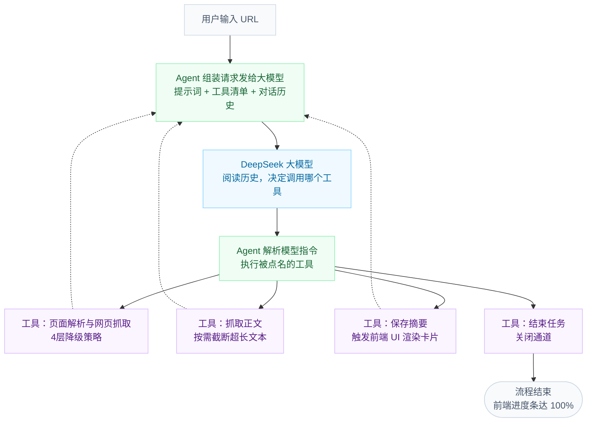

# 资讯速览小助手 - AI 新闻速览工具

> 基于 AI Agent 架构，快速提取并总结最新 AI 资讯的智能速览工具。

本项目专为 AI 行业从业者打造，定位为"AI 主动代理阅读"工具。用户只需粘贴"猫目 AI 快讯"网站或单篇文章的 URL，内置的 AI Agent 即可自动判断页面类型、抓取正文并生成要点摘要。短短 30 秒，帮你精准提炼当日值得阅读的 AI 动态。

<!-- ════════════════════════════════════════ -->
<!--           👇 产品截图展示              -->
<!-- ════════════════════════════════════════ -->

<table>
  <tr>
    <td width="50%"></td>
    <td width="50%"></td>
  </tr>
  <tr>
    <td width="50%"></td>
    <td width="50%"></td>
  </tr>
</table>

---

##  为什么做这个？

*   **痛点**：AI 行业信息密度极高且更新频繁，从业者每天需要浏览大量文章以追踪动态，逐篇点开判断内容价值既耗时又低效。
*   **解决方案**：输入 URL，工具会在 30 秒内交付当日 AI 资讯的要点集合。每个要点均附带原文链接，辅助用户快速决策是否需要深入阅读原文，大幅降低阅读决策成本。

##  工作原理

本项目底层采用 **Agent + LLM + Tools** 的 ReAct (Reason + Act) 闭环架构：

*   **LLM (大模型决策大脑)**：负责读取历史上下文，思考并返回具体的工具调用指令（`tool_call`）。
*   **Agent (智能体调度中枢)**：负责组装上下文、解析 LLM 指令、执行被点名的工具，并将执行结果写回历史记录。
*   **Tools (底层能力集)**：包含页面解析、正文抓取、数据管道推送等具体功能。



### 核心工作流分支

根据目标页面的不同，Agent 会自主决定走入以下两条链路：

#### 路径 A：列表页处理（多篇循环）

1. **试探与提取**：LLM 决策提取列表，Agent 调用 `提取列表` 工具解析出多篇文章链接并写回历史。
2. **逐篇解析**：LLM 遍历链接集并下达指令，Agent 循环调用 `抓取正文` 工具获取内容。
3. **摘要与渲染**：LLM 生成摘要并发存，Agent 调用 `保存摘要` 工具同步触发后端 Channel，驱动 UI 瀑布式弹出卡片。
4. **循环闭环**：任务全部处理完毕后，LLM 判定无后续任务，Agent 调用 `结束任务` 工具关闭通道。

#### 路径 B：单篇文章处理（智能降级）

1. **提取失败与降级**：Agent 尝试调用 `提取列表` 工具失败（提取数为 0），结果写回历史，LLM 感知并自动触发降级。
2. **直接抓取**：LLM 改变策略，Agent 直接对原始 URL 调用 `抓取正文` 工具。
3. **单篇摘要**：LLM 总结正文，Agent 调用 `保存摘要` 工具推送单张卡片。
4. **任务完结**：确认保存完毕后，Agent 调用 `结束任务` 工具闭环流程。

### Agent 工具链定义

| 工具 | 功能说明 |
| --- | --- |
| `get_article_list` | 从列表页提取文章链接 |
| `get_article_content` | 抓取单篇文章标题与正文 |
| `save_summary` | 保存大模型生成的摘要，并推送进度到 UI |
| `finish` | 标记当前任务已完成 |

##  功能特性

* **Agent 自主决策**：无需硬编码判断 URL 类型，大模型基于 ReAct 模式通过 function calling 自主决定工具调用顺序。
* **页面智能识别**：自动识别列表页并提取全部文章；识别单篇文章则直接抓取；遇到识别失败时可自动降级处理。
* **四级抓取降级策略**：支持 `curl` → `HttpClient` → `Playwright` → 静态 HTML 兜底，全面覆盖静态、动态及 JS 渲染页面。
* **多层级链接提取**：优先读取 Nuxt 内嵌 JSON → 其次使用配置选择器 → 随后调用 15 个通用降级选择器 → 最后全局扫描所有链接，确保高提取率。
* **UI 实时反馈**：结合进度条、状态日志滚动和摘要卡片逐个渲染，单篇文章抓取失败不会阻塞整体进度。
* **配置化高扩展**：如需新增新闻源，仅需在 `appsettings.json` 中添加对应的选择器配置即可。

##  核心架构决策 (Trade-offs)

* **舍弃规则引擎，采用 Agent 模式**：面对不确定的 URL 类型，采用 if-else 硬编码会导致核心决策能力脱离 AI，且难以扩展。将决策权交给大模型，虽增加 1-2 秒延迟，但换来了强大的自动降级能力与极高的扩展性。并且，将 Agent 的"思考过程"透明化，本身也构成了良好的用户体验。
* **使用 Channel 替代 Event / 回调**：Agent 在后台执行多轮操作且需高频推送 UI 状态。本项目采用 .NET 原生的 System.Threading.Channels，它自带背压机制且线程安全，完美契合 Blazor Server 的 SignalR 长连接通信模型。
* **深究抓取连通性，设计 4 层降级**：实测发现部分目标站点（如猫目 maomu.com）的 TLS 协议无法兼容 Windows 原生 HTTP 栈。将 `curl`（基于 OpenSSL）排在首位并非追求速度，而是因为它是唯一能稳定突破该站点限制的底层通道。
* **逐篇流式处理取代全局批处理**：批处理速度快但在处理期间前端处于"零反馈黑盒"状态。本项目改为逐篇处理，首屏摘要仅需约 5 秒即可渲染完毕。在 30 秒的整体耗时中，让用户持续看到"进度条推进与卡片弹出"的体感，远优于 15 秒的盲等。
* **架构预留 SQLite 数据模型**：任务与结果表结构已完整定义，但考虑到 MVP 阶段重在跑通核心速览流程，暂将结果置于内存并通过 Channel 推送。持久化与历史回顾功能留作后续版本演进。

##  技术栈

| 层级 | 技术方案 |
| --- | --- |
| **前端框架** | .NET 8 Blazor Server (InteractiveServer) |
| **数据库** | SQLite + EF Core 8 |
| **大模型** | DeepSeek API (`deepseek-chat`) |
| **网页抓取** | curl.exe / HttpClient / Playwright / HtmlAgilityPack |
| **实时通信** | System.Threading.Channels |

##  快速开始

### 环境要求

* .NET 8 SDK
* curl (Windows 10+ 默认自带)
* DeepSeek API Key

### 参数配置

请在 `appsettings.json` 中配置您的 DeepSeek API Key：

```json
{
  "DeepSeek": {
    "ApiKey": "your-api-key-here",
    "Model": "deepseek-chat"
  }
}

```

### 运行项目

```bash
cd 资讯速览小助手
dotnet run --urls http://localhost:5000

```

启动后，在浏览器访问 `http://localhost:5000`，粘贴文章链接即可体验。

##  核心项目结构

| 核心模块 | 职责说明 |
| --- | --- |
| `AgentEngine` | 驱动 ReAct 循环：大模型决策 → 执行关联工具 → 向前端推送进度 |
| `NewsSourceEngine` | 负责网页深度解析，包括链接提取、正文抓取与内容清洗 |
| `WebPageAccessor` | 多通道网络请求封装：curl → HttpClient → Playwright |
| `DeepSeekAccessor` | 提供底层的大语言模型 API 调用封装 |
| `NewsBriefingManager` | 业务流编排大脑，集中管理 Channel 数据管道 |

##  实测表现

* **精准路由**：输入首页可准确提取 8-10 篇新闻生成摘要；输入单篇 URL 自动切入单篇处理模式。
* **鲁棒容错**：输入未支持站点提示"暂不支持"；单篇抓取失败时能正常展示标题及错误信息并附带原文链接；中途取消任务时，已完成的部分保留，未完成的立即终止。
* **降级平滑**：当 curl 不可用时，系统能无缝降级至 HttpClient 或 Playwright。
* **性能指标**：批量处理 10 篇文章端到端耗时约 25-35 秒；第一篇摘要首屏耗时控制在 5 秒内。猫目文章提取成功率达 100%。
* **摘要质量**：输出文本严格收敛在 300 字以内，总结客观准确，经测试无模型幻觉。

##  演进路线

* **v1 (当前版本)**：实现单源速览（猫目）、Agent 自主决策、UI 实时进度渲染及 4 层网络抓取降级。
* **v2 (规划中)**：引入速览结果持久化、新增历史列表面板并支持多新闻源配置扩展。
* **v3 (规划中)**：增加定时自动速览、消息推送通知、基础用户系统及个性化资讯订阅功能。
