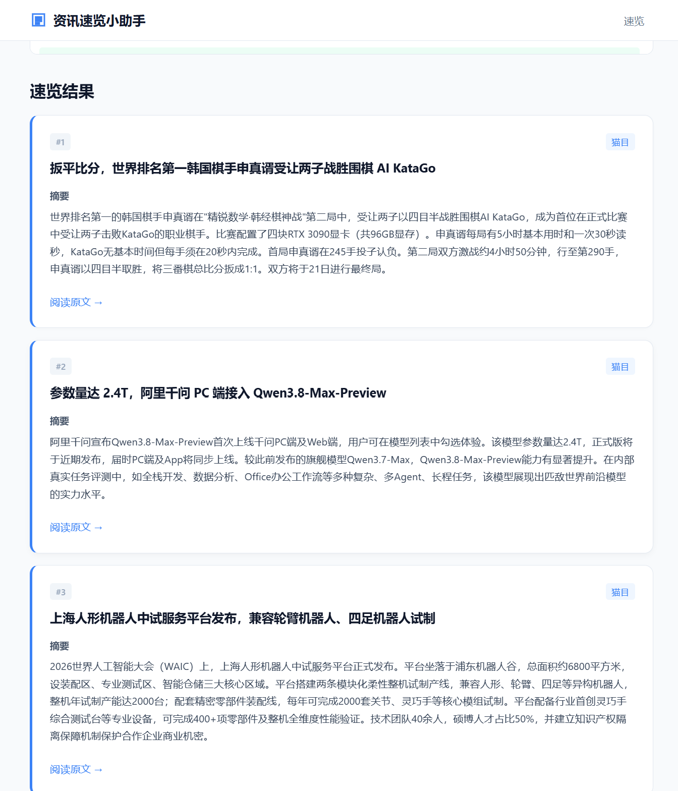
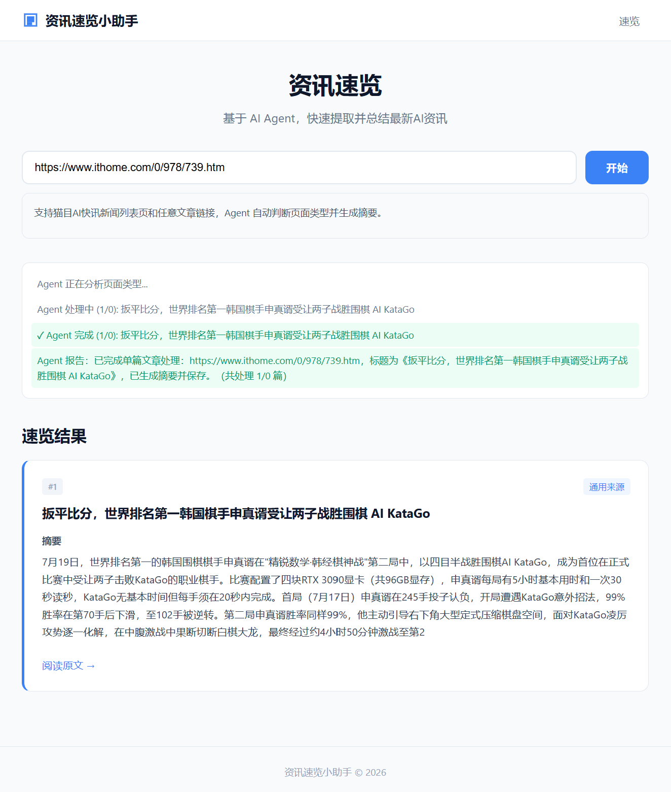
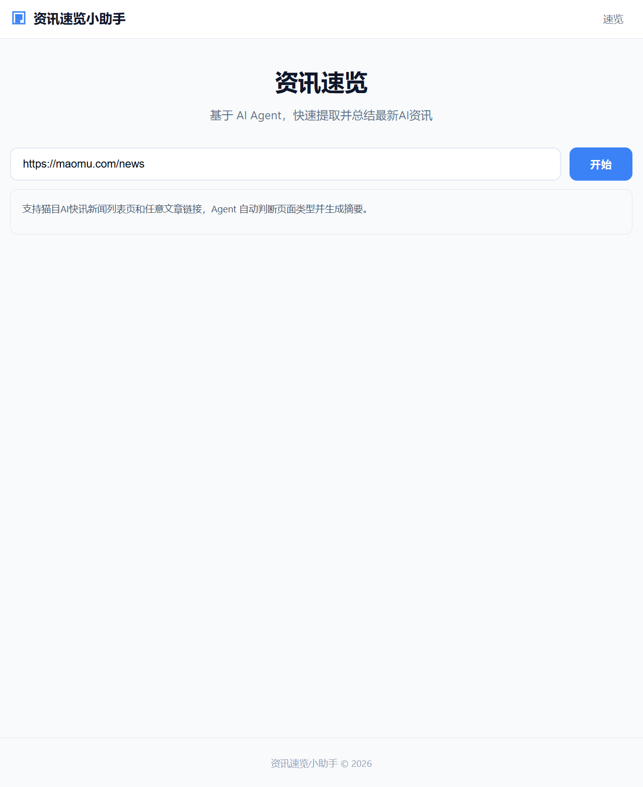
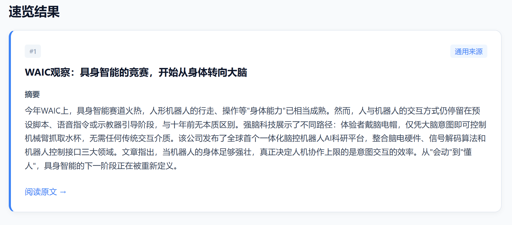
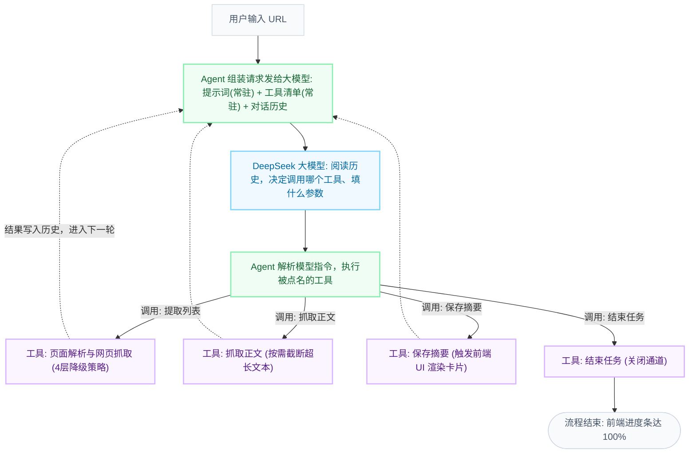

# 资讯速览小助手

> 粘贴一个 URL，AI Agent 自动判断页面类型、提取内容、生成摘要，30 秒告诉你今天发生了什么。

## 项目简介

在浏览资讯文章时，经常会遇到标题感兴趣但无法确定内容是否符合需求的问题。逐篇打开阅读不仅耗时，也降低了信息获取效率。

用户只需要输入一个 URL，Agent 会自主判断任务流程： 

- 如果是资讯列表页，自动提取文章列表并逐篇处理； 
- 如果是单篇文章，直接抓取正文； 
- 根据执行结果动态调整下一步动作； 
- 调用大模型生成摘要； 
- 实时向前端推送处理进度和结果。

## 项目演示 

### 1.资讯列表页多篇文章摘要生成






### 2.单篇文章摘要生成





## 工作原理



### 核心工作流 (Agent ReAct 机制)

本项目底层采用 **Agent + LLM + Tools** 的 ReAct (Reason + Act) 闭环架构。
* **LLM (大模型)**：担任决策大脑。负责阅读历史上下文，思考并返回调用的工具指令（`tool_call`）。
* **Agent (智能体引擎)**：担任调度中枢。负责组装上下文、解析 LLM 指令、**实际执行被点名的工具**，并将执行结果写回历史。
* **Tools (工具集)**：底层能力集。包括页面解析、正文抓取、数据管道推送等。

根据目标页面的不同，Agent 会在 LLM 的指挥下走入以下两条链路：

####  路径 A：列表页处理（多篇循环）
当输入的 URL 为文章列表或首页时：
1. **试探与提取**：LLM 首轮决策提取列表，**Agent 调用 `提取列表` 工具**，成功解析出多篇文章链接并写回历史。
2. **逐篇解析**：LLM 遍历链接集并依次下达抓取指令，**Agent 循环调用 `抓取正文` 工具**获取网页内容。
3. **摘要与渲染**：LLM 基于正文生成摘要并发出保存指令，**Agent 调用 `保存摘要` 工具**。该工具同步触发后端 Channel，驱动前端 UI 瀑布式弹出摘要卡片。
4. **循环闭环**：所有文章处理完毕后，LLM 判定无后续任务，**Agent 调用 `结束任务` 工具**关闭数据通道，进度达 100%。

####  路径 B：单篇文章处理（智能降级）
当输入的 URL 为具体的单篇文章详情页时：
1. **提取失败与降级**：**Agent 调用 `提取列表` 工具**未找到文章集（提取数为 0），结果写回历史。LLM 感知后自动触发降级策略。
2. **直接抓取**：LLM 改变策略下达单篇抓取指令，**Agent 直接对原始 URL 调用 `抓取正文` 工具**。
3. **单篇摘要**：LLM 总结正文并下发保存指令，**Agent 调用 `保存摘要` 工具**，驱动前端弹出单张摘要卡片。
4. **任务完结**：LLM 确认单篇文章已保存完毕，**Agent 调用 `结束任务` 工具**，流程闭环。

### Agent 工具链

| 工具 | 功能 |
|---|---|
| `get_article_list` | 从列表页提取文章链接 |
| `get_article_content` | 抓取单篇文章标题 + 正文 |
| `save_summary` | 保存大模型摘要并推送进度到 UI |
| `finish` | 标记任务完成 |

## 功能特性

- **Agent 自主决策**：基于 ReAct 模式，大模型通过 function calling 自主选择调用哪个工具，无需硬编码判断 URL 类型
- **页面类型自动识别**：列表页 → 提取全部文章；单篇文章 → 直接抓取；识别失败时自动降级
- **多级抓取降级**：`curl` → `HttpClient` → `Playwright` → 静态 HTML 兜底，覆盖静态 / 动态 / JS 渲染页面
- **多级链接提取降级**：Nuxt 内嵌 JSON → 配置选择器 → 15 个通用降级选择器 → 扫描全部链接
- **实时进度推送**：进度条 + 状态日志滚动 + 结果卡片逐个出现，单篇失败不影响整体
- **配置化扩展**：新增新闻源只需在 `appsettings.json` 中加一条选择器配置

## 核心设计取舍

**Agent 模式 vs 规则引擎**
URL 类型不确定，用规则引擎硬编码判断分支会让核心能力没用上 AI，且每加一种场景就加 if-else。把决策权交给大模型，虽然多 1-2 秒延迟，但换来自动降级与可扩展性，且思考过程对用户可见本身就是体验的一部分。

**Channel 而非 Event / 回调**
Agent 后台多轮执行，每步都要推状态到 UI。Channel 是 .NET 原生生产者-消费者管道，天然解耦、线程安全、自带背压，契合 Blazor Server 的 SignalR 长连接模型。

**抓取做 4 层降级**
实测发现猫目（maomu.com）的 TLS 配置不兼容 Windows 原生 HTTP 栈（HttpClient / Playwright 均超时），但 curl（基于 OpenSSL）可以稳定访问。因此 curl 排第一不是因为最快，而是它是唯一能稳定访问目标站点的通道。

**链接提取做 3 层降级**
核心场景（猫目等 Nuxt 站点）直接从内嵌 JSON 取数据最准；已知站点用配置选择器精确提取；未知站点用 15 个通用选择器 + 全链接扫描兜底，保证"几乎总能返回点结果"。

**逐篇处理而非批处理**
批处理快但等待期间零反馈；逐篇处理让进度条、日志、卡片实时推进，首屏约 5 秒出第一篇。进度可见性是这类产品的体验基石，30 秒的"可见进度"比 15 秒的"黑盒等待"体感更好。

**SQLite 但结果不持久化**
数据模型（任务表、结果表）已完整定义，但 MVP 阶段速览结果走内存经 Channel 推送。持久化需要配套历史列表页等 UI，先跑通核心流程，留作后续版本。

## 技术栈

| 层级     | 技术                                                 |
| -------- | ---------------------------------------------------- |
| 框架     | .NET 8 Blazor Server (InteractiveServer)             |
| 数据库   | SQLite + EF Core 8                                   |
| 大模型   | DeepSeek API (`deepseek-chat`)                       |
| 网页抓取 | curl.exe / HttpClient / Playwright / HtmlAgilityPack |
| 实时通信 | System.Threading.Channels                            |

## 快速开始

### 环境要求

- .NET 8 SDK
- curl（Windows 10+ 自带）
- DeepSeek API Key

### 配置

在 `appsettings.json` 中填入 API Key：

```json
{
  "DeepSeek": {
    "ApiKey": "your-api-key-here",
    "Model": "deepseek-chat"
  }
}
```

### 运行

```bash
cd 资讯速览小助手
dotnet run --urls http://localhost:5000
```

打开浏览器访问 `http://localhost:5000`，输入文章链接即可开始速览。

## 项目结构

```
Views (Blazor 页面)
  └── Managers (业务编排)
        └── Engines (核心引擎: Agent + NewsSource)
              └── Accessors (数据访问: DeepSeek + WebPage)
                    └── Database / Logic Contracts (数据模型)
```

| 模块 | 职责 |
|---|---|
| `AgentEngine` | ReAct 循环：调用大模型决策 → 执行工具 → 推送进度 |
| `NewsSourceEngine` | 网页解析：链接提取、正文抓取、内容清洗 |
| `WebPageAccessor` | 多通道抓取：curl → HttpClient → Playwright |
| `DeepSeekAccessor` | 大模型 API 调用封装 |
| `NewsBriefingManager` | 业务流程编排，管理 Channel 管道 |

## 实测效果

| 场景 | 结果 |
|---|---|
| 输入猫目首页 | 提取 8-10 篇并生成摘要 ✅ |
| 输入猫目单篇文章 | 自动识别为单篇模式 ✅ |
| 输入不支持的站点 | 提示"暂不支持该新闻源" ✅ |
| 单篇抓取失败 | 展示标题 + 错误 + 原文链接 ✅ |
| 处理中途取消 | 已完成保留，未完成停止 ✅ |
| curl 不可用时 | 自动降级到 HttpClient / Playwright ✅ |

- 端到端耗时：8 篇约 25-35 秒
- 首屏结果：第 1 篇摘要约 5 秒内出现
- 猫目文章提取成功率 100%（Nuxt JSON 路径）
- 摘要质量：300 字以内，客观准确，无幻觉编造

## 演进路线

| 版本 | 范围 |
|---|---|
| **v1（当前）** | 单源速览（猫目）、Agent 自主决策、实时进度、4 层抓取降级 |
| **v2** | 速览历史持久化 + 历史列表页 + 多源配置扩展 |
| **v3** | 定时自动速览 + 推送通知 + 用户系统 + 个性化订阅 |
